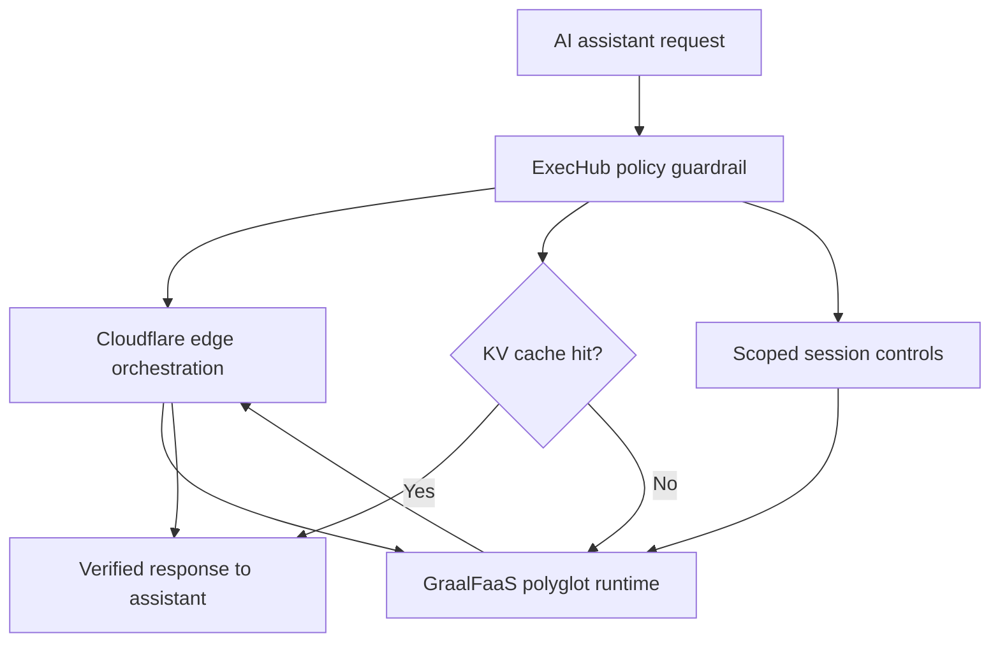
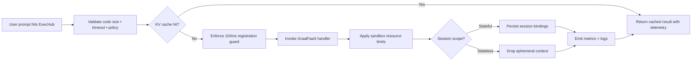
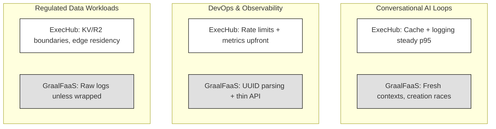
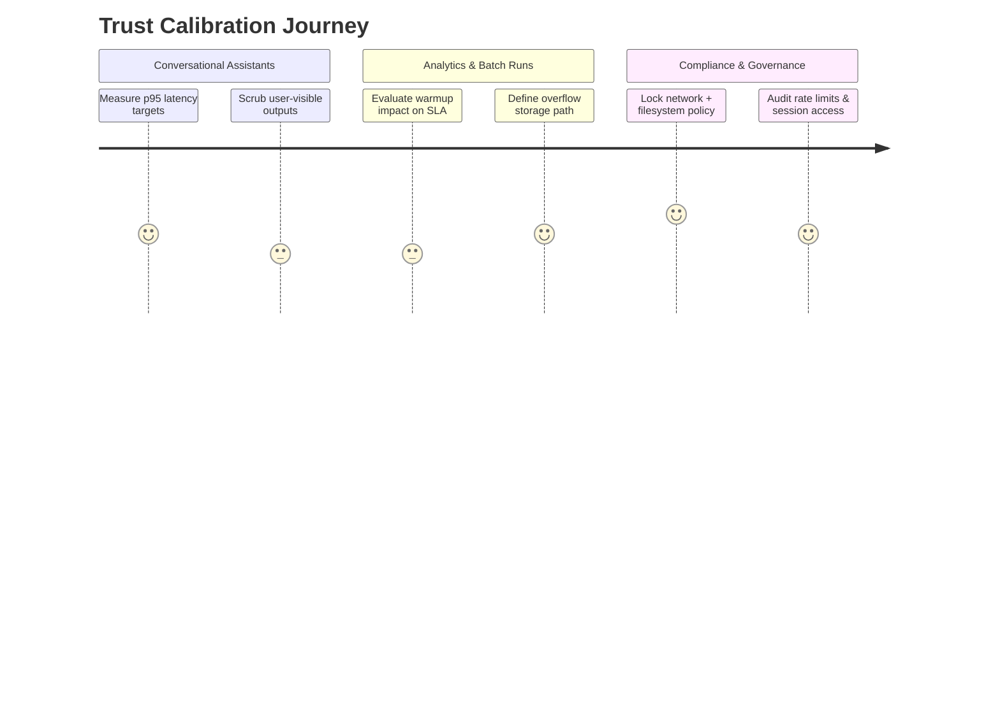

# Building Exechub: Calibrating Trust in Polyglot Edge Execution

### Summary
Trust-first execution: we evaluate ExecHub's orchestration against GraalFaaS's polyglot engine through consistency and edge latency.
Can an AI assistant rely on ephemeral functions when the backend ignores your IDs and races registration?
Edge compute and AI function calling finally intersect, making this the moment to decide how to host untrusted code.
Note: "Trust" here means repeatable <1s JavaScript runs, bounded Python warmups, and explicit limits on filesystem and network reach.

- Metric focus: trust across execution latency, sandbox isolation, and repeatability.
- Central question: can AI assistants depend on ephemeral functions that occasionally race their own registration?
- Context: assistants are moving to the edge just as GraalVM brings multi-language runtimes within reach.
- Clarification: "trust" combines sub-second JavaScript, bounded Python warmups, and explicit resource policies.

Trust stack at a glance:

---

### Core Problem

- Challenge: give AI assistants instant, safe, repeatable code execution without owning servers.
- Analogy: like letting students run experiments in a lab that must reset itself between classes.
- Why nuance matters: surface-level benchmarks ignore cold starts, backend UUID quirks, and session leakage.

AI assistants need live code execution that feels instant yet never leaks context; naive worker calls either stall on cold starts or overexpose resources, so we have to choreograph caching, sessions, and sandboxing together.

How the execution path balances latency and trust:

---

### Platform/Tool

## ExecHub 

**What It Offers**

High-level capabilities:
- Validates payload size, timeout ceilings, and session scope per request.
- Caches deterministic runs in Cloudflare KV for 5 minutes to collapse repeat latencies to <50ms.
- Manages session tokens that preserve state only when explicitly requested.

The Trust Proposition:
ExecHub acts as the policy brain—denying unsafe inputs, smoothing over GraalFaaS quirks, and ensuring assistant calls never see backend IDs.

Where Trust Matters Most:
- Conversational agents needing sub-second JavaScript answers.
- Education demos that replay identical snippets repeatedly.
- Teams demanding observability hooks before execution begins.

GraalFaaS Service: What It Offers

High-level capabilities:
- Spins up fresh GraalVM contexts per invocation for JavaScript, Python, and other polyglot targets.
- Provides multi-language interop and a minimal HTTP API for function creation and invocation.
- Delivers isolation strong enough to block filesystem and network access unless explicitly enabled.

The Trust Proposition:
GraalFaaS is the execution muscle—polyglot freedom with per-run isolation—so long as callers negotiate warmups, UUID parsing, and handler signatures.

Where Trust Matters Most:
- Polyglot workloads bouncing between JavaScript quick wins and Python data transformations.
- Scenarios where sandbox boundaries must be enforced outside traditional containers.
- Builders who want to lean on GraalVM performance without managing the runtime directly.

Cloudflare Workers Edge + KV: What It Offers

High-level capabilities:
- Globally distributed execution with service bindings for zero-hop communication between workers.
- Durable KV and R2 storage targets for caching outputs and offloading oversized stdout.
- Built-in rate limiting and secrets management to throttle abusive keys before they hit GraalFaaS.

The Trust Proposition:
Workers supply the low-latency edge and governance layer, letting ExecHub sit next to users while keeping GraalFaaS behind a controlled boundary.

Where Trust Matters Most:
- User-facing assistants that must execute near the request origin.
- Workloads requiring deterministic caching and replay at the edge.
- Compliance-sensitive deployments where data residency and auditability matter.

---

### Trust Across Domains: Where They Actually Differ

Domain 1: Conversational AI Loops
ExecHub's cache plus logging keeps p95 JavaScript runs under ~700ms even as GraalFaaS spins fresh contexts; direct GraalFaaS calls risk 100ms race conditions after creation unless you insert manual delays. The site worker stays stateless, so escalation is easy when threads demand continuity.

Domain 2: Developer Operations & Observability
ExecHub exposes API metrics and rate limits per key (100 requests / 60 seconds) before invocation, while GraalFaaS surfaces only raw function UUIDs. Service bindings mean Cloudflare handles auth and retries, but you still hash code to generate stable IDs and map them back to backend responses.

Domain 3: Regulated or Customer-Data Workloads
Cloudflare KV and optional R2 offloading let ExecHub redirect large stdout into controlled buckets, whereas GraalFaaS alone leaves you streaming raw logs. For tight compliance, keeping everything within the worker edge ensures data never leaves the network boundary unless you explicitly ship it.

### Three domains, two toolkits:

---

### The Confidence Problem

GraalFaaS promises polyglot isolation, but real reliability hinges on naming handlers correctly, parsing backend-generated UUIDs, and inserting a 100ms wait so functions exist before invocation; capabilities mean nothing until instrumentation proves stable outcomes.

---

### Building Your Own Trust Model

Instead of asking "which is better?", ask domain-specific trust questions:
- For conversational assistants:
    - What p95 latency keeps the chat feeling instant, and can KV caching cover repeat prompts?
    - How will you surface stdout or errors without exposing stack traces or secrets back to users?
- For analytics or batch code:
    - Can Python warmups of 1.5–2.5 seconds still meet SLAs, or do you need pre-warmed pools?
    - Where will oversized outputs land—KV, R2, or an external store you control?
- For compliance-heavy integrations:
    - Which domains must stay blocked at the GraalVM level to satisfy policy?
    - How are API keys rate-limited and audited when sessions persist across executions?

Checklist-driven calibration:

---

### The Philosophy of Trust

ExecHub treats trust as orchestration: constrain every call, observe before running, and hide lower-level instability. GraalFaaS leans into polyglot freedom—any language, any payload—assuming the caller absorbs registration drift. Cloudflare Workers prioritize edge locality and governance, which is why binding ExecHub and GraalFaaS balances policy with flexibility.

---

### My Honest Assessment

Reach for ExecHub when you need guardrails, caching, and policy decisions baked in; rely on GraalFaaS alone only if you accept ownership of UUID reconciliation, warmup delays, and handler discipline. Before promising reliability, invest in pre-warmed pools, expanded language coverage, R2 offloads for large outputs, and end-to-end telemetry that proves every run stayed within limits.

### The Real Question / Takeaway

The core decision is not "ExecHub or GraalFaaS?" but "How quickly can you prove a run was safe and repeatable?" Treat every execution as an experiment you must verify, and your assistants will earn trust one bounded function at a time.

