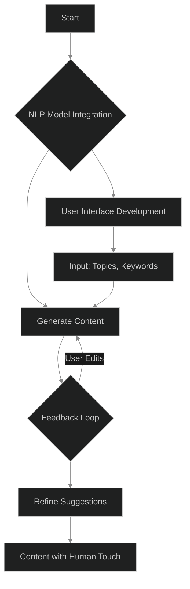
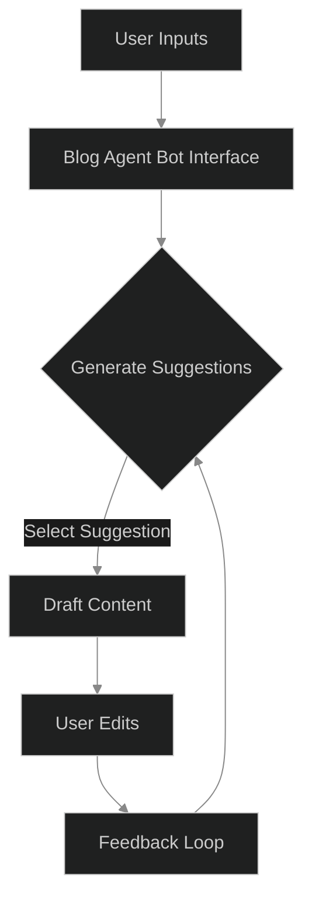
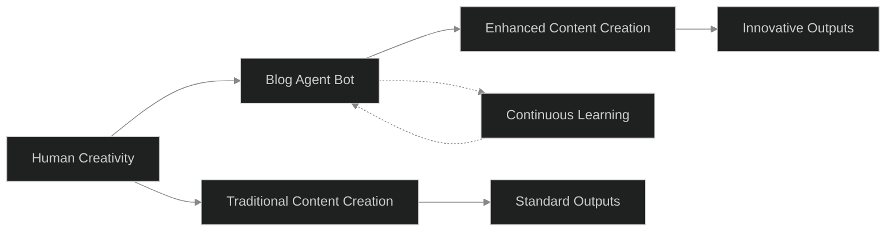

## Summary

In an era where content is king, the quest for automating content creation without sacrificing quality or human touch becomes paramount. Our journey in building the Blog Agent Bot—an AI-driven assistant designed to aid in content creation—presented a unique blend of challenges and insights. This project aimed to harness the power of natural language processing (NLP) to generate, suggest, and refine blog content, making the content creation process more efficient for writers and marketers alike. Throughout this endeavor, we learned not just about the technical hurdles of AI development but also about the philosophical implications of creating a machine that mimics human creativity.

## Core Problem/Challenge

The primary challenge was twofold: First, how do we create an AI that understands the nuances of human language well enough to generate coherent, engaging, and valuable content? And second, how do we ensure that this content retains a human touch, reflecting the author's voice and adhering to their intentions?

The technical challenges were steep, involving the integration of advanced NLP models, ensuring the bot could learn from feedback, and creating a user interface that was intuitive for non-technical users.

## Implementation Details

### NLP Models and Training

We started with a foundation of transformer-based models, known for their effectiveness in understanding and generating human-like text. The model was trained on a diverse dataset of blog posts, articles, and other forms of written content, with a focus on quality and variability to ensure a broad understanding of language and style.

### Feedback Loop

A crucial part of our implementation was the feedback loop, allowing the bot to learn from user edits and suggestions. This involved complex logic to parse user changes, identify patterns, and adjust the model's future suggestions accordingly.

### User Interface

Given the diverse user base, we opted for a minimalistic design for the interface, focusing on ease of use. The UI allows users to input topics, keywords, or even rough drafts, from which the bot generates content suggestions.

## Philosophy

As we delved deeper into the development, a philosophical question emerged: Can AI truly replicate human creativity, or is it merely mimicking patterns it has learned? Our perspective evolved to view the Blog Agent Bot not as a replacement for human creativity but as a tool to augment and inspire it. This shift in philosophy guided our implementation choices, emphasizing collaboration between human and machine rather than automation alone.

## Honest Assessment

### Successes

- The NLP model's ability to generate coherent and contextually relevant content exceeded our initial expectations.
- The feedback loop became a powerful tool for continuous improvement, with the bot showing significant enhancements in understanding user preferences over time.

### Challenges

- Ensuring diversity in content generation proved difficult, with the model sometimes falling into repetitive patterns.
- Balancing the bot's suggestions with user creativity required fine-tuning, as overly aggressive suggestions could stifle user input.

### Ongoing Work

- We're exploring more advanced techniques for understanding user intent and style, aiming for a more deeply personalized experience.
- Enhancing the feedback loop's efficiency and the model's ability to adapt more swiftly to user preferences is a priority.

## The Real Question

Through the development of the Blog Agent Bot, the real question we grappled with was not whether AI could replace human writers, but how AI could become a partner in the creative process. The journey taught us the importance of embracing chaos and uncertainty—not as obstacles but as opportunities for innovation and growth. In the end, we learned that the most effective use of AI in content creation lies in its ability to act as a muse and collaborator, amplifying human creativity rather than attempting to mimic it.

The Blog Agent Bot represents just the beginning of our exploration into the intersection of AI and human creativity. As we continue to refine and develop this tool, we remain committed to the philosophy that the best creations emerge from a partnership between human intuition and machine intelligence.

