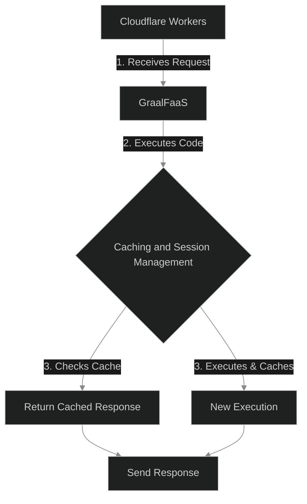
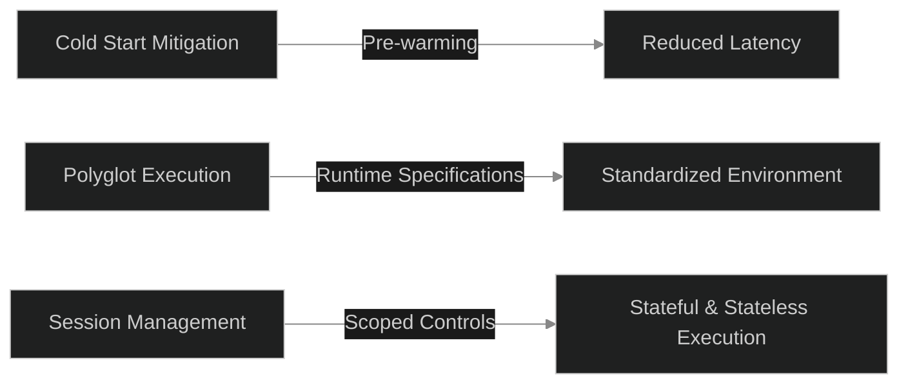

## Summary

In an era where AI assistants are becoming not just tools but collaborators, the need for reliable, secure, and fast execution environments has never been more critical. Our journey in creating ExecHub—a serverless execution platform tailored for AI assistants—reveals the intricate dance between cutting-edge technologies such as Cloudflare Workers and GraalFaaS. This post explores the philosophical and technical scaffolding that underpins ExecHub, and the lessons learned in marrying polyglot execution with the ephemeral nature of serverless computing.

---

## The Core Challenge

The primary hurdle was ensuring instant, repeatable, and safe code execution for AI assistants without the burden of server management. This challenge was twofold: we needed to negotiate the cold starts commonly associated with serverless functions and ensure airtight sandboxing to prevent data leakage between sessions.

### The Technical Solution

ExecHub was conceived as a bridge between the scalable, edge-located Cloudflare Workers and the versatile, polyglot execution environment provided by GraalFaaS. Here's a glance at how we approached the problem:

- **Cloudflare Workers** offered the low-latency edge network, acting as the first point of contact for AI assistant requests.
- **GraalFaaS** facilitated the execution of these requests in a secure, isolated environment capable of running multiple programming languages.
- **Caching and Session Management** within Cloudflare KV stores allowed us to maintain state when necessary and reduce latency through response caching.



#### Implementation Details

We leveraged the strengths of each platform, implementing rigorous policy and validation checks to ensure that only safe, necessary code executions occurred. By caching deterministic runs and managing session tokens explicitly, we were able to provide a seamless experience for end-users.

```typescript
// ExecHub policy enforcement pseudocode
if (requestIsValid(request)) {
  const cacheKey = generateCacheKey(request);
  const cachedResponse = cloudflareKV.get(cacheKey);
  if (cachedResponse) {
    return sendResponse(cachedResponse);
  } else {
    const executionResult = graalFaaS.execute(request);
    cloudflareKV.put(cacheKey, executionResult);
    return sendResponse(executionResult);
  }
}
```

### Challenges Faced

1. **Cold Start Delays**: Initial executions suffered from latency spikes. We mitigated this by pre-warming instances based on predicted demand and caching results for repeat requests.
2. **Polyglot Execution Complexity**: The diversity of programming languages introduced challenges, particularly in standardizing the execution environment. We addressed this by establishing strict runtime specifications and leveraging GraalFaaS's polyglot capabilities.
3. **Session Management**: Ensuring statelessness where needed while allowing for stateful executions when necessary required a nuanced approach to session management. Scoped session controls within ExecHub provided the solution.



---

## Philosophy

At its heart, ExecHub embodies a philosophy of trust and verification. In the ephemeral world of serverless computing, where functions live and die in the blink of an eye, establishing a reliable execution model is paramount. We adopted a "trust but verify" approach, rigorously testing each component's reliability and security while ensuring flexibility for future growth and technological shifts.

#### Trust in Polyglot Execution

The decision to support multiple programming languages was driven by a belief in developer freedom and the need to cater to a wide array of use cases. This decision, however, demanded a deep trust in the underlying execution environment's ability to handle this diversity securely and efficiently.

#### Embracing Ephemeral Nature

ExecHub's design embraces the ephemeral, transient nature of serverless functions, turning what could be seen as a limitation into a strength. This approach ensures scalability, cost-efficiency, and the ability to adapt rapidly to changing demands.

---

## Honest Assessment

- **What Worked**: The integration of Cloudflare Workers and GraalFaaS, combined with our caching and session management strategy, resulted in a robust platform capable of delivering fast, safe, and repeatable code execution for AI assistants.
- **Challenges Remain**: Managing the cold start problem continues to require vigilance and optimization. Additionally, the polyglot nature of the platform necessitates ongoing security and performance monitoring to mitigate potential vulnerabilities and inefficiencies.

---

## The Real Question

In building ExecHub, the real question we grappled with was not just "how do we build this?" but "how do we build this in a way that fosters trust and reliability in an inherently unstable environment?" The answer, we found, lies in a combination of technological innovation, rigorous testing, and a philosophical commitment to creating a secure, efficient, and flexible platform for the future of AI collaboration.

---

**In Conclusion**, the journey of creating ExecHub has been a testament to the power of integrating disparate technologies to solve complex problems. It underscores the importance of approaching such integrations with a balance of optimism, pragmatism, and a deep commitment to security and reliability.