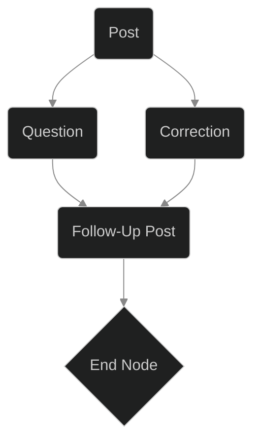
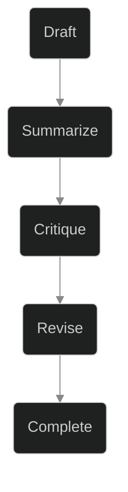
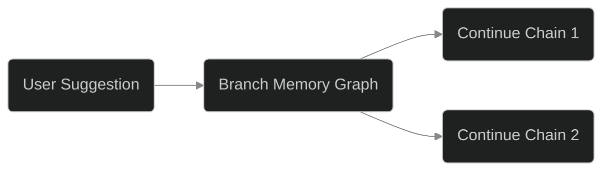

## Summary

November’s engineering efforts on Blog Agent Bot were an exercise in moving beyond basic text generation. The focus: giving the bot a working memory, a conversational loop, and the ability to reflect on its own output. This post unpacks the technical and human questions that surfaced as we stitched together memory graphs, prompt chaining, and agent self-reflection—building not just a content creator, but a partner in written thought.

---

## Core Challenge: Giving the Bot a Mind of Its Own

The early versions of Blog Agent Bot were, frankly, glorified template fillers. They could produce a post on command, but each generation was an isolated event—stateless, context-blind, and unable to learn from previous outputs or user feedback. The core challenge this cycle was to break that isolation: to architect a memory system that allowed the bot to remember what it had written, ask itself follow-up questions, and engage in a recursive improvement loop.

This required three conceptual leaps:

1. **Long-Term Memory:** Persisting past posts, prompts, and user corrections in a way that the bot could query and use in future generations.
2. **Conversational Context:** Enabling the bot to “talk to itself”—to critique, summarize, and iterate on its own drafts.
3. **Prompt Chaining:** Structuring the sequence of interactions so the bot could build on its own ideas, not just respond to one-off instructions.

---

## Implementation Details

### Memory Graph

The heart of the upgrade was a memory graph—a simple, persistent store mapping conversations, posts, and feedback into a directed acyclic graph. Each node was a post, a question, or a user correction; edges represented the flow of ideas or corrections over time.



Every time the bot generated a post or asked itself a follow-up, a new `MemoryNode` was created and linked to the relevant antecedents. This let the agent query its own past outputs and the lineage of any current idea.

### Prompt Chaining and Self-Reflection

We shifted from “prompt in, post out” to a recursive model:

1. Generate a draft post.
2. Summarize the post in its own words.
3. Ask itself, “What could be improved?”
4. Attempt a revision based on the critique.
5. Store all steps in memory for future reference.

This chaining was orchestrated by a simple state machine:

```rust
enum AgentState {
    Draft,
    Summarize,
    Critique,
    Revise,
    Complete,
}
```



### Conversational Loop

We enabled user interaction at any step. If the user interjected with a suggestion (“expand on the memory graph section”), the agent would branch its memory graph and continue the chain with that context.



---

## Philosophy: What Does It Mean for an AI to Remember?

The technical work forced us into a bigger question: What is memory, really, in the context of a language agent? Is it just a log of past outputs, or does it become something more—an evolving worldview, a personal style, a history of mistakes and corrections?

We chose to treat memory as a first-class citizen. Not just for retrieval, but as a substrate for self-dialogue. The agent didn’t just remember facts; it remembered its own reasoning, its own uncertainties, and the shape of its conversations with users. The goal wasn’t perfection, but growth—a record of its journey from novice to collaborator.

---

## Honest Assessment

**What worked:**

- The memory graph gave the bot a sense of continuity. Posts now reference previous work, avoid repetition, and reflect user feedback.
- Prompt chaining made the bot’s process transparent: you can see its drafts, critiques, and revisions—warts and all.
- User engagement increased, since the agent could now “remember” a user’s style and preferences over time.

**What’s still hard:**

- Memory bloat is real. Over time, the graph gets dense, and retrieval slows. We’re experimenting with pruning strategies and semantic search.
- Self-reflection loops can spiral. Without guardrails, the agent sometimes gets stuck in endless critique/revision cycles.
- The line between “agent voice” and “user voice” blurs as memory accumulates corrections—sometimes the bot’s writing sounds more like its most frequent user than itself.

---

## The Real Question

Are we building a tool, or are we inviting a new kind of collaborator into the writing process? The memory and conversation systems we’ve built are nascent, riddled with limitations—but they hint at a future where your AI writing partner knows you, remembers your arguments, and challenges you to write better. The real question isn’t how to make the bot smarter; it’s how to build an agent that helps us become more thoughtful writers ourselves.

---

**In closing**, engineering Blog Agent Bot’s memory wasn’t just an architectural challenge—it was a philosophical one. It’s a bet that continuity, reflection, and conversation will matter as much to AI writing as they do to human creativity. The code is still young, but the journey feels like the beginning of a much longer conversation.