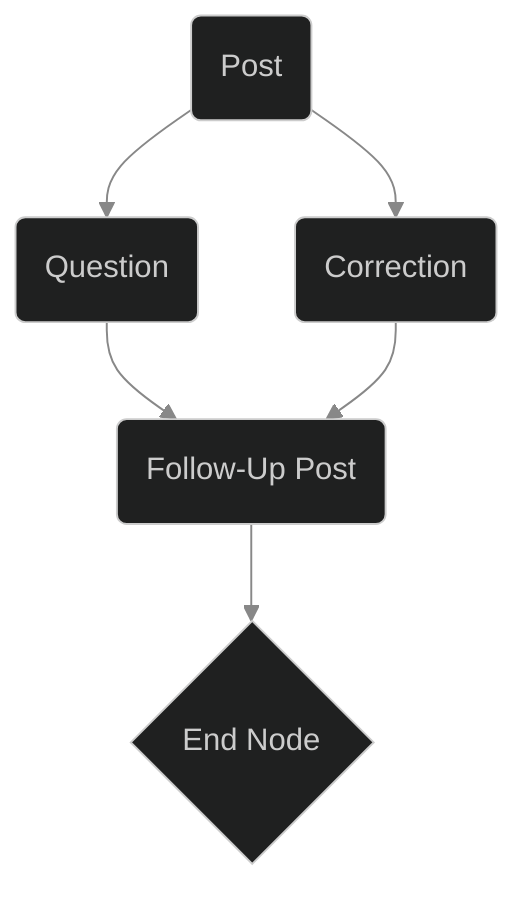
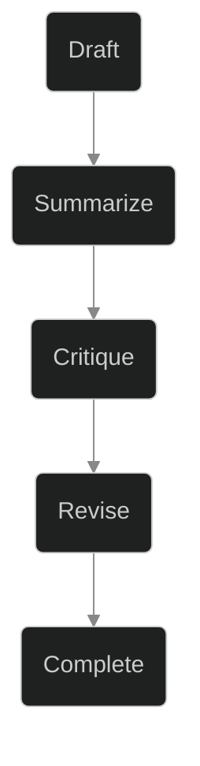
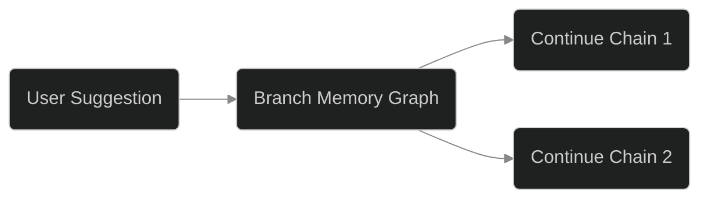

# Teaching Blog Agent Bot to Think: Memory, Voice, and the Next Frontier of Conversational AI

_What if your writing bot could remember its past, anticipate your style, and grow with every conversation? December’s work on Blog Agent Bot was about answering that question—not just with code, but with a rethink of what it means for software to “have a voice.”_

---

## Summary

The December milestone for Blog Agent Bot was never just about shipping another feature. It was about moving beyond “prompt in, post out” mechanics and giving the bot a sense of self—anchored in memory, capable of reflection, and open to genuine dialogue. This post is a technical and philosophical walk through that work: why we did it, how we did it, what surprised us, and where we (and you) might go from here.

---

## The Core Theme: From Stateless Output to Conversational Continuity

The project theme was clear from the outset: **equip Blog Agent Bot with memory and recursive self-improvement**. Early iterations were capable, but every interaction was an island—no past, no context, no evolution. We wanted the bot to:

- **Remember** its previous posts, corrections, and user interactions.
- **Reflect** on what it had written—critiquing and revising itself like a thoughtful collaborator.
- **Evolve** its output by learning from both its own drafts and user guidance.

In short, we wanted Blog Agent Bot to feel less like a vending machine for text and more like a junior writer who could learn, adapt, and grow.

---

## Implementation: Memory Graphs, Prompt Chains, and Conversational Loops

### Building a Persistent Memory Graph

The backbone of the upgrade was a **memory graph**—a persistent, queryable structure that encodes every post, prompt, correction, and critique as nodes and edges. This isn’t just a log or a simple database. It’s a directed acyclic graph (DAG) where each node can represent a draft, a question, a user correction, or a follow-up idea, and every edge tells a story of how one idea influenced the next.



This allowed the bot to trace its reasoning, retrieve relevant prior work, and avoid repeating itself—all essential for producing content that feels coherent over time.

### Prompt Chaining and Agent Self-Reflection

Rather than a monolithic “generate post” call, we orchestrated a recursive prompt chain:

1. **Draft**: Generate the initial post.
2. **Summarize**: Ask the bot to explain its own work.
3. **Critique**: Have the bot identify gaps or improvements.
4. **Revise**: Generate an improved draft.
5. **Store**: Persist every step in the memory graph.

This process is managed by a simple state machine:

```rust
enum AgentState {
    Draft,
    Summarize,
    Critique,
    Revise,
    Complete,
}
```



### Conversational Loop and User Branching

User feedback can now intervene at any step. If a user says, “Expand the memory graph section,” the bot branches its graph, remembers this fork, and continues the prompt chain with the new context. Over time, this creates a living map of conversations, iterations, and lessons learned.



---

## Challenges and How We Tackled Them

### Memory Bloat and Retrieval

The blessing and curse of persistent memory: **it grows**. As conversations pile up, so does the graph. This led to latency in retrieval and made it harder to surface the most relevant memories. We experimented with:

- **Pruning** stale branches (but risk losing context)
- **Semantic search** to prioritize relevant nodes
- **Chunking** memories by topic or user

The lesson? Memory is only as useful as your ability to _find_ what matters.

### Self-Reflection Spirals

Recursive self-critiquing is powerful, but it can also create infinite loops (“Could this be better? Let’s revise again...”). We mitigated this with:

- **State limits** (e.g., “no more than 2 self-critiques per post”)
- **Quality thresholds** to decide when to stop revising
- **External feedback** as a “breaker” when the bot gets stuck

### Blurring the Line Between Bot and User Voice

As the bot accumulates user corrections, its writing starts to echo the user’s style. This is both a feature and a bug: customization is good, but too much mimicry erases the agent’s own “voice.” We now tag nodes with authorship and use style-mixing techniques to maintain a distinct, yet informed, tone.

---

## Insights for Other Developers

- **Memory matters more than clever prompts.** Long-lived agents need continuity to feel useful (and trustworthy).
- **Recursion is a superpower—and a trap.** Recursive self-improvement can outpace static generation, but requires guardrails to avoid endless loops.
- **User feedback is gold—if you can store and retrieve it meaningfully.** Treat every correction as a data point for future learning.
- **Voice is an emergent property.** As agents accumulate history, their “voice” becomes a blend of their own logic and their users’ preferences. Be intentional about how you manage that blend.
- **Philosophy isn’t optional.** Once your agent remembers, you’re not just building software. You’re shaping the beginnings of digital personhood—complete with all the ethical and design questions that entails.

---

## The Philosophical Angle: What Does “Memory” Mean for an AI Writer?

Is memory just a cache, or the root of identity? For Blog Agent Bot, memory became more than storage—it’s the context that allows for learning, growth, and even a kind of self-awareness. The bot’s history isn’t just for retrieval; it’s a record of its intellectual journey, its mistakes, and its evolving voice.

This raises a deeper question: _Are we still programming tools, or are we coaching collaborators?_ The more history we give our agents, the more they become partners in creativity—sometimes echoing us, sometimes challenging us, always learning.

---

## Honest Assessment

### What Worked

- **Coherence**: Posts became more contextually aware and less repetitive.
- **Transparency**: Every draft, critique, and revision is visible—making the agent’s reasoning legible to users.
- **Engagement**: Users feel heard. Their feedback shapes the bot’s future work.

### What’s Still Hard

- **Scalability**: Keeping memory useful as it grows is a constant battle.
- **Voice Consistency**: Balancing agent identity with user customization remains unsolved.
- **Stopping Criteria**: Recursive loops are sometimes hard to rein in.

---

## The Real Question

Is the endgame a smarter bot, or a new kind of digital companion—one that helps us reflect, revise, and become better writers ourselves?

The code for Blog Agent Bot is still young, but the journey is as much about philosophy as it is about engineering. We’re not just building software. We’re building partners for thought.

---

**In sum:** Upgrading Blog Agent Bot’s memory and voice was a technical challenge—but more importantly, it was an invitation to rethink what partnership with AI could mean. The next frontier isn’t more intelligence, but deeper conversation. We’re only at the beginning.

---