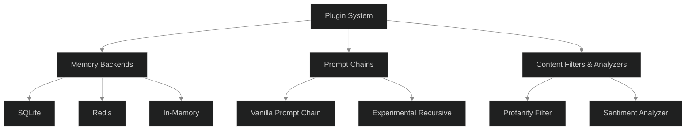
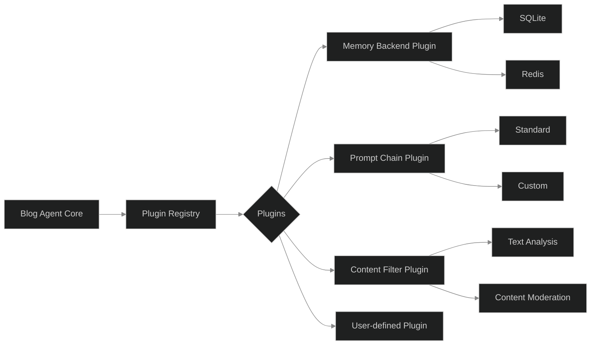

# From Prototypes to Plugins: Designing a Modular Architecture for Blog Agent Bot

*What do you do when your once-simple agent starts outgrowing its shell? December’s work on Blog Agent Bot was about more than adding features—it was a deep dive into the art (and pain) of modularity. This is the story of why we refactored almost everything, how we learned to draw better boundaries, and what “extensibility” really means in practice.*

---

## Summary

The last development cycle for Blog Agent Bot was dominated by a single, ambitious theme: **make everything pluggable**. The original codebase—nimble, expressive, but monolithic—had hit the limits of its own cleverness. New features were getting harder to add, and ad hoc integrations were piling up. The solution? Rip out the tangled core and replace it with a plugin system, where every major capability (from prompt templates to memory stores) could be swapped, extended, or replaced at runtime.

This post walks through that architectural shift: the technical decisions, the refactoring process, what broke along the way, and the deeper lessons about software growth, abstraction, and humility.

---

## The Core Problem: Outgrowing the Prototype

Early Blog Agent Bot was a joy to work on. Every new feature was just a new function call—until it wasn’t. As we added:

- Multiple memory backends (in-memory, SQLite, cloud)
- Experimental prompt chains
- Custom content analyzers
- User-defined rewrite rules

… the code started to rot in the usual ways. Every new feature came with a branching `match` or a brittle trait object. Tests grew slower and less reliable. Worse, it became obvious that the next big feature—user-contributed plugins—would force us to rethink everything, or else fork the whole project for each experiment.

The **core challenge**: How can we design for extensibility *without* sacrificing the tight feedback loops that made the original agent fun to hack on?

---

## Implementation: The Plugin System

### Drawing the Boundaries

Step one was identifying which parts of the agent should be pluggable. We landed on three primary extension points:

1. **Memory Backends**: How and where are conversations, posts, and critiques stored?
2. **Prompt Chains**: How are multi-step tasks (draft, critique, revise) orchestrated?
3. **Content Filters & Analyzers**: How is generated text post-processed, tagged, or blocked?

Each of these became a trait:

```rust
pub trait MemoryBackend: Send + Sync {
    fn store(&self, item: MemoryItem) -> Result<()>;
    fn retrieve(&self, query: MemoryQuery) -> Result<Vec<MemoryItem>>;
}

pub trait PromptChain: Send + Sync {
    fn run(&self, input: PromptInput) -> PromptResult;
}

pub trait ContentFilter: Send + Sync {
    fn filter(&self, text: &str) -> FilterResult;
}
```

And a registry:

```rust
pub struct PluginRegistry {
    memory: Box<dyn MemoryBackend>,
    prompt_chain: Box<dyn PromptChain>,
    filters: Vec<Box<dyn ContentFilter>>,
}
```

Now, swapping out a SQLite database for a Redis store, or a vanilla prompt chain for an experimental recursive one, was a matter of registering a different plugin.



### Plugin Loading and Configuration

To maximize flexibility, we allowed plugins to be loaded dynamically from config files, with support for default fallbacks and per-user overrides. Here’s a simplified example:

```toml
[memory]
backend = "sqlite"
dsn = "file:blog_agent.db"

[prompt_chain]
type = "self_reflecting"

[filters]
enabled = ["profanity_filter", "sentiment_analyzer"]
```

At startup, the agent loads and wires up the specified plugins:

```rust
fn load_plugins(config: &Config) -> PluginRegistry {
    // (Pseudocode)
    let memory = match config.memory.backend.as_str() {
        "sqlite" => Box::new(SqliteBackend::new(&config.memory.dsn)),
        "redis" => Box::new(RedisBackend::new(&config.memory.dsn)),
        _ => Box::new(InMemoryBackend::default()),
    };

    // ... same for prompt_chain and filters ...
    PluginRegistry { memory, prompt_chain, filters }
}
```

### Extending Without Forking

The real win: **external contributors can add new plugins** without changing the agent’s core. As long as their crate implements the right trait and is discoverable on the path, the agent can load it at runtime.



---

## Challenges and How We Tackled Them

### The Interface Trap

The first big challenge: **over-abstracting too early**. It’s tempting to define a “super-trait” that covers every possible future need. But every method you add to the trait is a contract you can’t easily break later. We started with huge traits, then whittled them down to the minimum viable boundary—sometimes just a single method.

**Lesson:** You can always add new extension points. Removing or changing them is much harder. Start small, evolve deliberately.

### Plugin Hell: Managing Dependencies

With pluggability comes a new class of dependency hell. Plugins have their own crates, versions, and transitive dependencies—every combination was a new integration risk.

We solved this by:

- **Static plugin discovery** during development (bake plugins into the build)
- **Version pinning** for all plugin crates
- **Automated tests** for every plugin/agent combination

It’s not perfect, but it’s less chaotic than the alternatives.

### The Performance Tax

Dynamic dispatch and trait objects have a cost—especially in a language like Rust, where generics are fast but trait objects are not. Early benchmarks showed a 10–15% slowdown for plugin-heavy workflows.

For now, we’ve accepted the tradeoff in exchange for flexibility, but we’re exploring ways to specialize hot paths with generics or codegen in future releases.

---

## Insights for Other Developers

- **Modularity means saying no.** The hardest part of plugin design is deciding what *not* to expose. Every method you leave out is a bug you avoid later.
- **Extensibility is a moving target.** You won’t anticipate the best extension points on day one. Build in feedback loops and expect to iterate.
- **Tests are your lifeline.** As the number of plugins grows, integration tests become your only defense against regression and combinatorial chaos.
- **Documentation is part of the contract.** If you want others to write plugins, the trait docs must be clear, stable, and honest about tradeoffs.

---

## Philosophy: The Art of Drawing Boundaries

Software grows by drawing lines—between core and extension, between now and next month, between “ours” and “theirs.” But every line is a bet on the future. Draw them too tight, and you stifle growth. Draw them too loose, and you drown in complexity.

The plugin system forced us to confront this head-on. The right boundary is not the one that anticipates every future, but the one that lets you change your mind with the least pain. The best architecture is not finished—it’s hospitable.

> The real purpose of modularity is not to make change easy, but to make learning possible.

With plugins, we trade certainty for adaptability. The agent is no longer a finished product—it’s a living platform, shaped as much by its users as its original authors.

---

## Honest Assessment

### What Worked

- **Rapid experimentation:** New memory stores and prompt chains landed with almost no core changes.
- **Community engagement:** Contributors could add features without forking the codebase.
- **Cleaner tests:** Each plugin could be tested in isolation, reducing flakiness.

### What’s Still Hard

- **Performance:** Trait objects add measurable overhead; Rust’s strengths are blunted.
- **Plugin compatibility:** Versioning and dependency hell remain a lurking risk.
- **Boundary drift:** The temptation to “just add one more method” to a trait is ever-present.

---

## The Real Question

Is the goal to build the perfect agent, or to build an ecosystem where new ideas can survive their first contact with reality? With plugins, we’re betting on the latter.

The hardest interface is always the one you’ll want to extend next month. The best plugin system is the one you can live with, even as your hopes and your code evolve.

**In sum:** Making Blog Agent Bot pluggable was less about adding features, and more about learning how not to freeze our own imagination. The code is cleaner now, but more importantly, the boundaries are flexible—and that’s the real win.

---

*If you’re building something you hope will last, ask yourself: Where do you want to draw your boundaries? And, just as crucially—how will you redraw them when the world changes?*