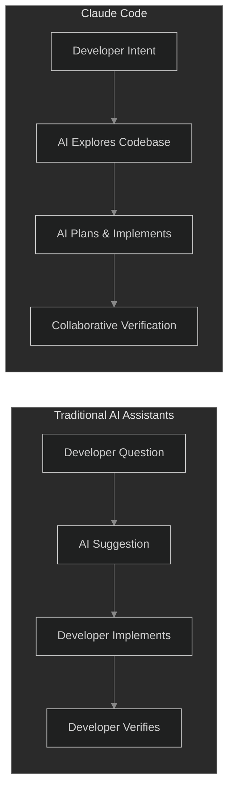
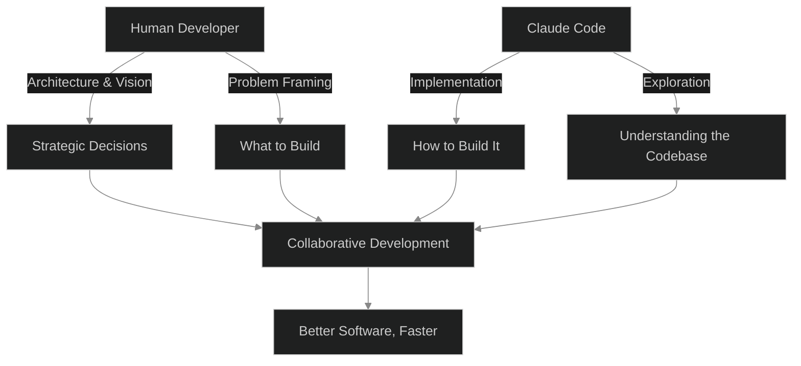

## Summary

We've grown accustomed to AI that talks about code. Tools that suggest completions, generate snippets, and explain errors. But there's a categorical difference between an AI that describes what you could do and one that works alongside you to actually do it. Claude Code represents this shift—from conversational assistant to genuine development partner. This post explores not just what Claude Code does, but what it signals about the evolving relationship between developers and their tools.

---

## The Core Shift

For years, the AI development tool paradigm has followed a familiar pattern: you ask a question, you receive an answer. You describe a function, you get a suggestion. The human remains the sole executor, translating AI output into actual changes. This model treats AI as a very sophisticated search engine—useful, but fundamentally passive.

Claude Code breaks this pattern. It doesn't just suggest; it acts. It reads your actual codebase, understands your project structure, executes commands, and makes changes. The loop between intention and implementation compresses dramatically.

### What This Means in Practice

Consider debugging a complex issue. With a traditional assistant, you copy error messages, paste code snippets, describe your setup, and hope you've provided enough context. You're essentially a human API, translating between your environment and a model that can't see it.

With Claude Code, the model navigates your filesystem, reads relevant files, runs tests, and iteratively works toward a solution. It can observe the actual error, check related files for context, and verify that its fix works. The developer's role shifts from translator to collaborator.

---

## The Deeper Significance

### Trust and Verification

There's an understandable hesitation when an AI can modify your code. The instinct toward caution is correct. But Claude Code doesn't ask for blind trust—it operates transparently, showing what it intends to do before doing it, and leaving a clear trail of changes that can be reviewed, reverted, or refined.

This model mirrors healthy human collaboration: propose, discuss, act, verify. The difference is speed. What might take a back-and-forth with a colleague over hours can happen in minutes.

### Amplification, Not Replacement

A common fear with development AI is obsolescence. Will these tools replace developers? The evidence suggests a different trajectory: amplification. Claude Code doesn't eliminate the need for human judgment—it amplifies a developer's capacity to act on that judgment.

The bottleneck in software development has never been typing speed. It's understanding context, making decisions, and navigating complexity. Claude Code handles much of the mechanical translation between decision and implementation, freeing the developer to focus on the problems that require human insight.

### Democratization of Capability

Perhaps most significantly, tools like Claude Code lower the barrier to software creation. A junior developer paired with Claude Code can tackle problems that previously required years of accumulated context. A domain expert with basic coding knowledge can build functional tools without depending entirely on engineering resources.

This isn't about making everyone a programmer—it's about making software development accessible to anyone with a clear idea of what they want to build.

---

## Philosophy

Claude Code embodies a philosophy that has been gaining momentum in the AI space: that the most powerful AI systems are not those that operate in isolation, but those that integrate deeply into human workflows. The agentic paradigm—where AI takes action rather than just providing information—represents a maturation of what we expect from our tools.

### The Command Line as Canvas

There's something fitting about Claude Code existing in the terminal. The command line has always been the domain of direct action, where intentions become immediate outcomes. Unlike the layers of abstraction in graphical interfaces, the CLI is honest about what's happening. Claude Code inherits this honesty—its operations are visible, its changes are trackable, and its reasoning can be interrogated.

### Collaboration as the Core Paradigm

The most important aspect of Claude Code isn't its capability to act—it's the quality of collaboration it enables. A good collaboration partner doesn't just follow instructions; they understand context, anticipate needs, and offer alternatives you hadn't considered. Claude Code approaches this ideal more closely than any previous tool in this space.

---

## Honest Assessment

- **What Works**: The integration of exploration, planning, and execution into a single workflow dramatically reduces friction in development tasks. The ability to work with your actual codebase rather than abstractions of it represents a genuine advance.

- **Where Caution Remains**: Complex architectural decisions still require human judgment. The tool excels at well-defined tasks but can struggle when requirements are ambiguous or when the correct approach depends on business context the model doesn't have access to.

- **The Learning Curve**: Working effectively with Claude Code requires a shift in thinking. Developers accustomed to being the sole executor must learn to guide, verify, and occasionally course-correct an AI partner. This collaboration skill itself is emerging as valuable.

---

## The Real Question

The question Claude Code raises isn't whether AI can help us write code—that's been answered. The real question is how we want to work alongside AI systems that can genuinely act as partners rather than just advisors.

This question extends beyond software development. As AI systems become more capable of taking action in the world, the patterns we establish in development workflows—transparency, verification, collaboration, clear boundaries—will inform how we integrate AI into other domains.

Claude Code isn't just a productivity tool. It's a preview of a future where the line between human capability and AI augmentation becomes increasingly blurred, and where the quality of our outcomes depends not on choosing between human and artificial intelligence, but on orchestrating both effectively.

---

**In Conclusion**, Claude Code matters not because it makes coding faster—though it does—but because it demonstrates a new paradigm of human-AI collaboration. The developers and teams who learn to work effectively within this paradigm will have a significant advantage, not just in speed, but in the complexity and ambition of what they can build. The question is no longer whether AI will transform software development. It's how quickly we adapt to a world where our most capable coding partner isn't human.
